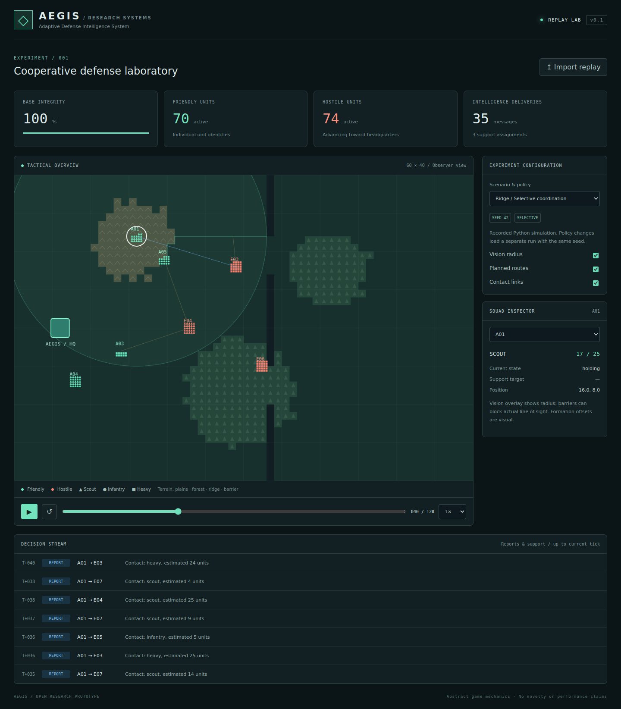

# AEGIS
### Adaptive Defense Intelligence System

A research-oriented RTS defense simulator with a Python simulation core and a React + PixiJS replay laboratory. **Exploratory prototype, not a validated new algorithm.**



## Version 0.1
- Seeded terrain: plains, forest, ridges and impassable barriers.
- Four-neighbor A* with unit-class movement costs and barrier-based line of sight.
- Individually identified soldiers organized into squads of up to 25.
- Fictional scout, infantry and heavy profiles; simultaneous abstract combat resolution.
- Three policies: isolated squads, periodic broadcast, selective reporting with a reserve.
- Timestamped observations, support requests and stale-report expiry.
- Interactive map, unit selection, vision radius, route overlays, replay timeline and decision stream.
- Ridge (330 initial units), siege (600) and stress (1,000 total: 500 friendly + 500 hostile).

## Quick start — Windows / PowerShell
Install Python 3.12+ and Node.js 22+ with npm. From the repository root:

```powershell
python -m unittest discover -v
cd web
npm.cmd ci
npm.cmd run dev
```
Open the local URL printed by Vite. Four replays are bundled; **no Python server is required** to view them. `npm.cmd` also avoids PowerShell's npm.ps1 execution-policy issue.

## Generate your own run
From the repository root:

```powershell
python -m aegis.cli --scenario siege --policy selective --seed 17 --ticks 120 --output results/siege.json
python -m aegis.benchmark --scenario stress --seeds 10
```
Click **Import replay** in the web interface and select `results/siege.json`. On macOS/Linux use `npm` instead of `npm.cmd`.

## Production build
```sh
cd web
npm ci
npm run build
npm run preview
```

## Structure
| Folder | Responsibility |
| --- | --- |
| `aegis/` | Simulation, observation, coordination, routing and CLI |
| `web/src/` | React controls and PixiJS battlefield |
| `web/public/replays/` | Reproducible example runs |
| `tests/` | Determinism, path and state-invariant tests |
| `docs/` | Model assumptions, research protocol and replay format |

## Reading order
`models.py` → `terrain.py` → `pathfinding.py` → `coordination.py` → `engine.py` → `cli.py`.

## Honest scope
Each soldier has a unique identity and alive/dead state. Movement and combat decisions are **squad-level**. The 5×5 individual soldier offsets are visual and may overlap obstacles or other formations; this release does not implement collision-free per-soldier motion. Maps stay fixed within a run. There is no trained ML policy, weapon realism, fog-of-war rendering, live browser control or measured novelty claim. The observer UI shows ground truth, but support decisions use received reports.

The two communicating policies also differ in dispatch rules; their comparison is a system comparison, not a controlled proof that communication alone causes a result. See [research protocol](docs/RESEARCH.md).

## License
MIT — see [LICENSE](LICENSE). Procedural graphics are generated by this project. External packages retain their own licenses. Web fonts are optional; system fonts work offline.
